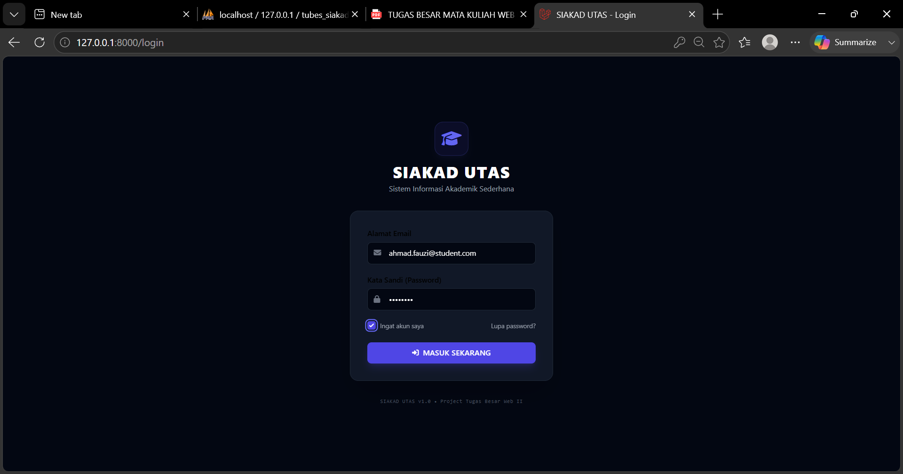
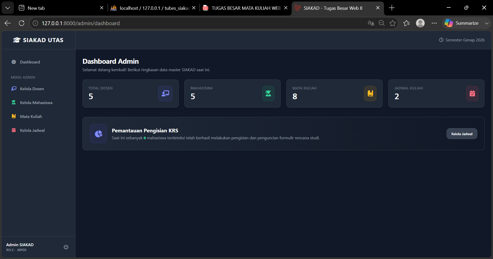
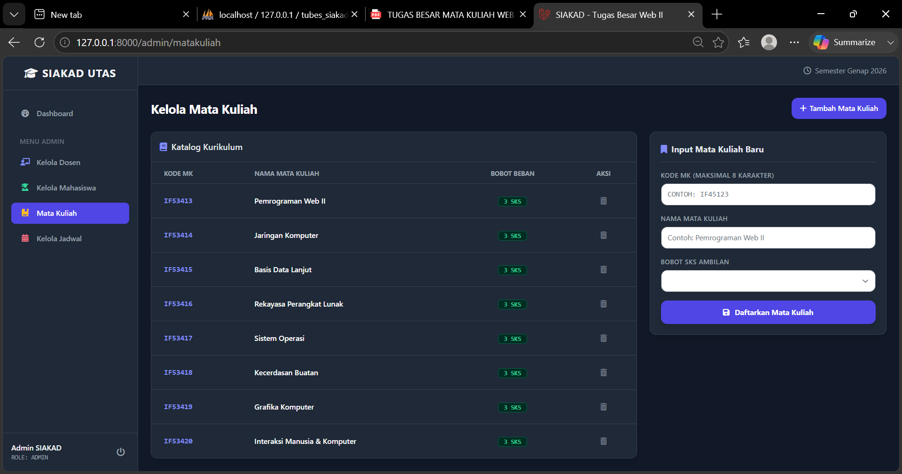
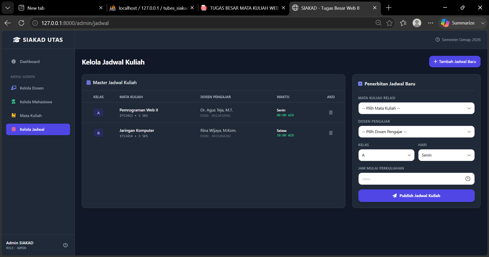
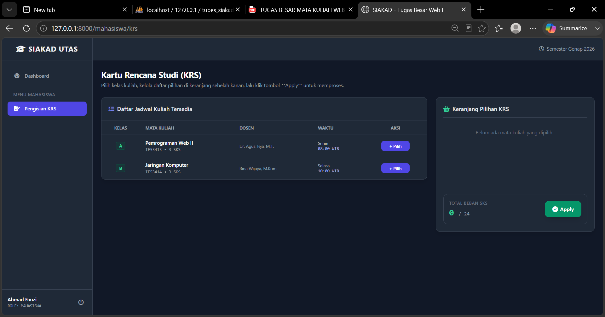

# SIAKAD UTAS - Sistem Informasi Akademik Sederhana

Aplikasi web berbasis Laravel yang mensimulasikan Sistem Informasi Akademik (SIAKAD) sederhana untuk memenuhi Tugas Besar mata kuliah Web II. Aplikasi ini mendukung arsitektur Multi-role (Admin & Mahasiswa) menggunakan Spatie Roles & Permissions, serta menerapkan validasi form yang ketat dan Eloquent Relationship.

---

## 👤 Identitas Mahasiswa
* **Nama:** Muhammad Dziqri Alghifar
* **NPM:** 5520124050
* **Kelas:** Teknik Informatika - IF-B 2024

---

## 🌐 Link Deployment / Hosting
Aplikasi Tidak di deploy

---

## 🚀 Penjelasan Fitur Aplikasi

Aplikasi SIAKAD UTAS ini memiliki beberapa fitur utama yang terbagi berdasarkan hak akses pengguna:

### 1. Authentication & Authorization
* **Login & Logout:** Pengamanan hak akses akun menggunakan middleware Laravel Auth yang langsung mengarah ke halaman login utama saat aplikasi diakses.
* **Role Admin:** Hak akses penuh untuk mengelola seluruh data master akademik (CRUD).
* **Role Mahasiswa:** Hak akses terbatas hanya untuk melakukan simulasi pengisian KRS dan melihat jadwal kuliah.

### 2. Manajemen Data Admin (CRUD Data Master)
* **Kelola Data Dosen:** Menambah, melihat, mengupdate, dan menghapus data identitas dosen (NIDN & Nama) secara real-time.
* **Kelola Data Mahasiswa:** Manajemen data mahasiswa serta plotting Dosen Wali berdasarkan data dosen pengampu yang tersedia.
* **Kelola Data Mata Kuliah:** Manajemen struktur kurikulum, penamaan mata kuliah, beserta alokasi bobot beban SKS ambolan.
* **Kelola Data Jadwal:** Menerbitkan jadwal perkuliahan dengan merelasikan data Mata Kuliah, Dosen Pengajar, Hari, Jam, dan Kelas.

### 3. Modul Mahasiswa (Kartu Rencana Studi)
* **Pengisian KRS:** Mahasiswa dapat memilih kelas jadwal kuliah yang tersedia dan melakukan *Apply KRS* ke sistem database.
* **Lihat & Drop KRS:** Menampilkan daftar KRS yang sukses diambil secara real-time dan menyediakan opsi pembatalan kelas (*Drop* mata kuliah).
* **Export KRS (Bonus Tambahan):** Fitur untuk mencetak atau mengunduh lembar Kartu Rencana Studi ke dalam bentuk dokumen PDF.

---

## 🛠️ Spesifikasi Ketentuan Teknis
Aplikasi ini dibangun menggunakan arsitektur bawaan Laravel dengan memanfaatkan:
* **Database Migration:** Untuk menyusun dan membangun struktur skema tabel basis data akademik secara konsisten.
* **Database Seeder (Modular):** Menyediakan 5 sub-seeder otomatis (Role, Dosen, Mahasiswa, Matakuliah, Jadwal) sebagai pancingan data awal sistem.
* **Eloquent Relationship:** Menerapkan relasi database lintas tabel (One-to-Many & Many-to-Many) untuk menampilkan informasi terintegrasi pada antarmuka.
* **Form Validation:** Proteksi keamanan inputan pada setiap form transaksi data untuk menghindari eror runtime database.

---

## 📸 Screenshots Aplikasi

Berikut adalah dokumentasi visual antarmuka dari aplikasi SIAKAD UTAS:

### 1. Halaman Login (Elegant Dark Mode)

### 2. Halaman Dashboard Admin

### 3. Halaman Kelola Mata Kuliah (CRUD)

### 4. Halaman Kelola Jadwal Kuliah (CRUD)

### 5. Halaman Pengisian KRS (Sisi Mahasiswa)
